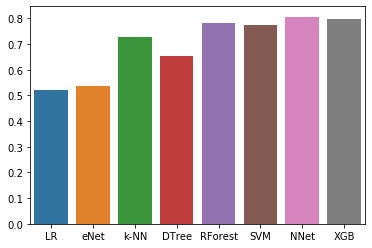

# Asteroid Size Estimator

This notebook showcases regression on a dataset on asteroid sizes.

See the original on [kaggle](https://www.kaggle.com/liamkesatoran/asteroid-diameter-estimators-with-added-difficulty)


*  **Goal:** Getting the diameter of an asteroid from the other data given about that asteroid, in other words supervised regression with the target being log(diameter).   
The metric used during testing will be the R^2 score.
* **How:**
    * Step 1: Cleaning and preparing the data
        * a. I cleared the samples with nan diameter.
        * b. The dataframe had a lot of nan values, I chose to substitute them with the average value for the corresponding feature.
        * c. Diameter and "neo" and "pha" features where encoded in strings so I had to convert them to int for the regression.
    * Step 2: Train-test splitting of the data, and then normalizing (standard) using the test dataframe.
    * Step 3: Trying different regression algorithms (Linear Regression, Elastic Net, Decision Tree, Random Forest, XGBoost, SVM, Neural Network) and picking the best one.
* **Extra:**  Since some features had a very high correlation with \log(diameter) I removed the features who had a Pearson R coefficient R>0.5 for the added challenge and curiosity.


**Dependencies: numpy, pandas, matplotlib, seaborn, scikit-learn, xgboost, keras.**


```python
import numpy as np
import pandas as pd
import matplotlib.pyplot as plt
```

## Part I: Importing, exploration & cleaning of the data


```python
#Importing only the first 30000 rows
#Data found here: https://www.kaggle.com/basu369victor/prediction-of-asteroid-diameter
df = pd.read_csv('Asteroid.csv',nrows = 30000)
```


```python
df.head()
```


<div>
<style scoped>
    .dataframe tbody tr th:only-of-type {
        vertical-align: middle;
    }

    .dataframe tbody tr th {
        vertical-align: top;
    }

    .dataframe thead th {
        text-align: right;
    }
</style>
<table border="1" class="dataframe">
  <thead>
    <tr style="text-align: right;">
      <th></th>
      <th>full_name</th>
      <th>a</th>
      <th>e</th>
      <th>G</th>
      <th>i</th>
      <th>om</th>
      <th>w</th>
      <th>q</th>
      <th>ad</th>
      <th>per_y</th>
      <th>...</th>
      <th>rot_per</th>
      <th>GM</th>
      <th>BV</th>
      <th>UB</th>
      <th>IR</th>
      <th>spec_B</th>
      <th>spec_T</th>
      <th>neo</th>
      <th>pha</th>
      <th>moid</th>
    </tr>
  </thead>
  <tbody>
    <tr>
      <th>0</th>
      <td>1 Ceres</td>
      <td>2.769165</td>
      <td>0.076009</td>
      <td>0.12</td>
      <td>10.594067</td>
      <td>80.305532</td>
      <td>73.597694</td>
      <td>2.558684</td>
      <td>2.979647</td>
      <td>4.608202</td>
      <td>...</td>
      <td>9.074170</td>
      <td>62.6284</td>
      <td>0.713</td>
      <td>0.426</td>
      <td>NaN</td>
      <td>C</td>
      <td>G</td>
      <td>N</td>
      <td>N</td>
      <td>1.59478</td>
    </tr>
    <tr>
      <th>1</th>
      <td>2 Pallas</td>
      <td>2.772466</td>
      <td>0.230337</td>
      <td>0.11</td>
      <td>34.836234</td>
      <td>173.080063</td>
      <td>310.048857</td>
      <td>2.133865</td>
      <td>3.411067</td>
      <td>4.616444</td>
      <td>...</td>
      <td>7.813200</td>
      <td>14.3000</td>
      <td>0.635</td>
      <td>0.284</td>
      <td>NaN</td>
      <td>B</td>
      <td>B</td>
      <td>N</td>
      <td>N</td>
      <td>1.23324</td>
    </tr>
    <tr>
      <th>2</th>
      <td>3 Juno</td>
      <td>2.669150</td>
      <td>0.256942</td>
      <td>0.32</td>
      <td>12.988919</td>
      <td>169.852760</td>
      <td>248.138626</td>
      <td>1.983332</td>
      <td>3.354967</td>
      <td>4.360814</td>
      <td>...</td>
      <td>7.210000</td>
      <td>NaN</td>
      <td>0.824</td>
      <td>0.433</td>
      <td>NaN</td>
      <td>Sk</td>
      <td>S</td>
      <td>N</td>
      <td>N</td>
      <td>1.03454</td>
    </tr>
    <tr>
      <th>3</th>
      <td>4 Vesta</td>
      <td>2.361418</td>
      <td>0.088721</td>
      <td>0.32</td>
      <td>7.141771</td>
      <td>103.810804</td>
      <td>150.728541</td>
      <td>2.151909</td>
      <td>2.570926</td>
      <td>3.628837</td>
      <td>...</td>
      <td>5.342128</td>
      <td>17.8000</td>
      <td>0.782</td>
      <td>0.492</td>
      <td>NaN</td>
      <td>V</td>
      <td>V</td>
      <td>N</td>
      <td>N</td>
      <td>1.13948</td>
    </tr>
    <tr>
      <th>4</th>
      <td>5 Astraea</td>
      <td>2.574249</td>
      <td>0.191095</td>
      <td>NaN</td>
      <td>5.366988</td>
      <td>141.576604</td>
      <td>358.687608</td>
      <td>2.082324</td>
      <td>3.066174</td>
      <td>4.130323</td>
      <td>...</td>
      <td>16.806000</td>
      <td>NaN</td>
      <td>0.826</td>
      <td>0.411</td>
      <td>NaN</td>
      <td>S</td>
      <td>S</td>
      <td>N</td>
      <td>N</td>
      <td>1.09589</td>
    </tr>
  </tbody>
</table>
<p>5 rows × 27 columns</p>
</div>


**There are lots of feature columns to check:**   
First I wanted to know if there are NaN values (there are and will be dealt with later)


```python
#Checking which columns(features) have nan values
for column in df.columns:
    print(column, df[column].isnull().values.any())
```

    full_name False
    a False
    e False
    G True
    i False
    om False
    w False
    q False
    ad False
    per_y False
    data_arc False
    condition_code False
    n_obs_used False
    H False
    diameter True
    extent True
    albedo True
    rot_per True
    GM True
    BV True
    UB True
    IR True
    spec_B True
    spec_T True
    neo False
    pha False
    moid False


Next thing is to understand what type of data we're dealing with


```python
#Printing the first ten unique values of each feature
for column in df.columns:
    print(column, df[column].unique()[:10])
```

    full_name ['     1 Ceres' '     2 Pallas' '     3 Juno' '     4 Vesta'
     '     5 Astraea' '     6 Hebe' '     7 Iris' '     8 Flora'
     '     9 Metis' '    10 Hygiea']
    a [2.76916515 2.77246592 2.66914952 2.3614179  2.57424892 2.42515999
     2.38533381 2.20176419 2.38563654 3.14153918]
    e [0.07600903 0.23033682 0.25694232 0.08872146 0.19109452 0.20300711
     0.23120579 0.15649925 0.12311427 0.11246066]
    G [0.12 0.11 0.32  nan 0.24 0.28 0.17 0.22 0.23 0.2 ]
    i [10.59406704 34.83623442 12.98891913  7.14177081  5.36698794 14.7379011
      5.52365139  5.88695456  5.57681551  3.83156003]
    om [ 80.30553157 173.08006275 169.85275981 103.81080443 141.57660421
     138.64020276 259.56323069 110.88932989  68.9085767  283.20216686]
    w [ 73.59769412 310.04885743 248.13862618 150.72854129 358.68760779
     239.80749023 145.26510583 285.28746222   6.41736923 312.31520625]
    q [2.5586836  2.13386493 1.98333205 2.15190945 2.08232406 1.93283527
     1.83383082 1.85718974 2.09193063 2.78823962]
    ad [2.97964671 3.41106691 3.35496699 2.57092634 3.06617378 2.91748471
     2.93683681 2.54633864 2.67934244 3.49483874]
    per_y [4.6082018  4.61644353 4.36081392 3.62883714 4.13032295 3.77675484
     3.68410457 3.2671149  3.68480592 5.56829099]
    data_arc [ 8822 72318 72684 24288 63431 62329 62452 62655 61821 62175]
    condition_code [0 2 1 4 3]
    n_obs_used [1002 8490 7104 9325 2861 6034 5206 2744 2649 3409]
    H [3.34 4.13 5.33 3.2  6.85 5.71 5.51 6.49 6.28 5.43]
    diameter ['939.4' '545' '246.596' '525.4' '106.699' '185.18' '199.83' '147.491'
     '190' '407.12']
    extent ['964.4 x 964.2 x 891.8' '582x556x500' nan '572.6 x 557.2 x 446.4'
     '279 x 232 x 189' '276x94x78' '59.8x25.4x18.6' '34.4x11.2x11.2'
     '18.2x10.5x8.9' '5.0x2.0x2.1']
    albedo [0.09   0.101  0.214  0.4228 0.274  0.2679 0.2766 0.226  0.118  0.0717]
    rot_per [ 9.07417     7.8132      7.21        5.34212766 16.806       7.2745
      7.139      12.865       5.079      27.63      ]
    GM [6.26284e+01 1.43000e+01         nan 1.78000e+01 7.00000e+00 1.53000e+00
     4.91000e-01 7.47500e-01 2.75000e-03 6.89000e-03]
    BV [0.713 0.635 0.824 0.782 0.826 0.822 0.855 0.885 0.858 0.696]
    UB [0.426 0.284 0.433 0.492 0.411 0.399 0.484 0.489 0.496 0.351]
    IR [nan]
    spec_B ['C' 'B' 'Sk' 'V' 'S' nan 'L' 'Ch' 'X' 'Sl']
    spec_T ['G' 'B' 'S' 'V' 'C' 'M' 'E' 'FC' 'P' 'CG']
    neo ['N' 'Y']
    pha ['N' 'Y']
    moid [1.59478  1.23324  1.03454  1.13948  1.09589  0.973965 0.8461   0.874176
     1.10691  1.77839 ]


* **Cleaning and prepping the dataframe:**  
**Steps:**
    * 0/ 'diameter' is string type, I will convert to numeric. This gave errors for some diameters because they were corrupted, so I added the argument "errors='coerce'" to set corrupted diameters to nan, and later dropped those.
    * 1/ Dropping irrelevent features and choosing my battles:
        * 1a/ IR is full of nans so I will drop it
        * 1b/ I will drop full name too as I dont believe asteroids are named according to their diameter
        * 1c/ 'extent' is also string type but 3d_types, since I suspect its the asteroid dimentions I will drop it
        * 1d/ dropping condition_code too because most seems to be 0 or nan.
        * 1e/ spec_B and spec_T might be interesting but I choose to drop them because we already have a lot to deal with. One way to take advantage of those values would be to use one-hot encoding but this would add around 50 features columns.
    * 2/ Transform neo and pha (Y,N) string type values to (True,False) bool(binary int) values
    * 3/ Replace nans entries with mean value of column


```python
#Steps 0
df['diameter']=pd.to_numeric(df['diameter'],errors='coerce') #transforming to numeric, setting errors to NaN
dropindexes = df['diameter'][df['diameter'].isnull()].index #rows with nan diameters to drop
dropped_df = df.loc[dropindexes] #saving dropped rows for the future
df = df.drop(dropindexes, axis=0)
```


```python
#Steps 1
df = df.drop(['condition_code','full_name','IR','spec_B','spec_T','extent'],axis=1)
```


```python
#Step 2
df = df.replace({'neo': {'Y': True, 'N': False}})
df = df.replace({'pha': {'Y': True, 'N': False}})
```


```python
#Step 3
df = df.fillna(df.mean())
```


```python
df.head()
```


<div>
<style scoped>
    .dataframe tbody tr th:only-of-type {
        vertical-align: middle;
    }

    .dataframe tbody tr th {
        vertical-align: top;
    }

    .dataframe thead th {
        text-align: right;
    }
</style>
<table border="1" class="dataframe">
  <thead>
    <tr style="text-align: right;">
      <th></th>
      <th>a</th>
      <th>e</th>
      <th>G</th>
      <th>i</th>
      <th>om</th>
      <th>w</th>
      <th>q</th>
      <th>ad</th>
      <th>per_y</th>
      <th>data_arc</th>
      <th>...</th>
      <th>H</th>
      <th>diameter</th>
      <th>albedo</th>
      <th>rot_per</th>
      <th>GM</th>
      <th>BV</th>
      <th>UB</th>
      <th>neo</th>
      <th>pha</th>
      <th>moid</th>
    </tr>
  </thead>
  <tbody>
    <tr>
      <th>0</th>
      <td>2.769165</td>
      <td>0.076009</td>
      <td>0.120000</td>
      <td>10.594067</td>
      <td>80.305532</td>
      <td>73.597694</td>
      <td>2.558684</td>
      <td>2.979647</td>
      <td>4.608202</td>
      <td>8822</td>
      <td>...</td>
      <td>3.34</td>
      <td>939.400</td>
      <td>0.0900</td>
      <td>9.074170</td>
      <td>62.62840</td>
      <td>0.713</td>
      <td>0.426</td>
      <td>False</td>
      <td>False</td>
      <td>1.59478</td>
    </tr>
    <tr>
      <th>1</th>
      <td>2.772466</td>
      <td>0.230337</td>
      <td>0.110000</td>
      <td>34.836234</td>
      <td>173.080063</td>
      <td>310.048857</td>
      <td>2.133865</td>
      <td>3.411067</td>
      <td>4.616444</td>
      <td>72318</td>
      <td>...</td>
      <td>4.13</td>
      <td>545.000</td>
      <td>0.1010</td>
      <td>7.813200</td>
      <td>14.30000</td>
      <td>0.635</td>
      <td>0.284</td>
      <td>False</td>
      <td>False</td>
      <td>1.23324</td>
    </tr>
    <tr>
      <th>2</th>
      <td>2.669150</td>
      <td>0.256942</td>
      <td>0.320000</td>
      <td>12.988919</td>
      <td>169.852760</td>
      <td>248.138626</td>
      <td>1.983332</td>
      <td>3.354967</td>
      <td>4.360814</td>
      <td>72684</td>
      <td>...</td>
      <td>5.33</td>
      <td>246.596</td>
      <td>0.2140</td>
      <td>7.210000</td>
      <td>9.81609</td>
      <td>0.824</td>
      <td>0.433</td>
      <td>False</td>
      <td>False</td>
      <td>1.03454</td>
    </tr>
    <tr>
      <th>3</th>
      <td>2.361418</td>
      <td>0.088721</td>
      <td>0.320000</td>
      <td>7.141771</td>
      <td>103.810804</td>
      <td>150.728541</td>
      <td>2.151909</td>
      <td>2.570926</td>
      <td>3.628837</td>
      <td>24288</td>
      <td>...</td>
      <td>3.20</td>
      <td>525.400</td>
      <td>0.4228</td>
      <td>5.342128</td>
      <td>17.80000</td>
      <td>0.782</td>
      <td>0.492</td>
      <td>False</td>
      <td>False</td>
      <td>1.13948</td>
    </tr>
    <tr>
      <th>4</th>
      <td>2.574249</td>
      <td>0.191095</td>
      <td>0.186579</td>
      <td>5.366988</td>
      <td>141.576604</td>
      <td>358.687608</td>
      <td>2.082324</td>
      <td>3.066174</td>
      <td>4.130323</td>
      <td>63431</td>
      <td>...</td>
      <td>6.85</td>
      <td>106.699</td>
      <td>0.2740</td>
      <td>16.806000</td>
      <td>9.81609</td>
      <td>0.826</td>
      <td>0.411</td>
      <td>False</td>
      <td>False</td>
      <td>1.09589</td>
    </tr>
  </tbody>
</table>
<p>5 rows × 21 columns</p>
</div>


```python
#Last sanity check for nan values
df.isna().values.any()
```


    False


Since a lot of values in physics are more relevant when you consider their log, I'll add columns to the dataframe corresponding to the log of the original columns:


```python
df['diameter']= df['diameter'].apply(np.log)
for column in df.columns.drop(['diameter','neo','pha']):
    df['log('+column+')']=df[column].apply(np.log)
df = df.dropna(axis=1)
```

Correlation analysis:


```python
df.corr()['diameter'].abs().sort_values(ascending=False)
```


    diameter           1.000000
    H                  0.906135
    log(H)             0.896375
    log(albedo)        0.629475
    log(per_y)         0.622497
    log(a)             0.622497
    log(ad)            0.605441
    data_arc           0.583459
    albedo             0.579702
    log(q)             0.533683
    n_obs_used         0.526710
    log(data_arc)      0.522696
    log(moid)          0.504905
    a                  0.500553
    log(n_obs_used)    0.483892
    moid               0.477567
    ad                 0.476470
    q                  0.473422
    per_y              0.316803
    i                  0.255413
    log(i)             0.211454
    log(UB)            0.128233
    log(BV)            0.128004
    neo                0.119973
    log(rot_per)       0.117464
    BV                 0.104449
    pha                0.089169
    UB                 0.079716
    log(e)             0.059763
    e                  0.055441
    GM                 0.028507
    log(GM)            0.007384
    rot_per            0.006152
    w                  0.004292
    log(w)             0.004283
    G                  0.003705
    log(om)            0.002104
    om                 0.001198
    Name: diameter, dtype: float64


Nasa's own Asteroid Size Estimator website uses the H value and \log(albedo): https://cneos.jpl.nasa.gov/tools/ast_size_est.html

Optional: Removing columns that give too high correlation for curiosity / added difficulty:


```python
### Optional : removing columns that give too high correlation(R>.5) for curiosity

#Identifing columns to drop and dropping them
tooHighCorr = df.columns[(df.corr()['diameter'].abs()  > 0.5)]
df = df.drop(tooHighCorr.drop('diameter'),axis=1)

#checking the effect
df.corr()['diameter'].abs().sort_values(ascending=False).head()
```


    diameter           1.000000
    log(n_obs_used)    0.483892
    moid               0.477567
    ad                 0.476470
    q                  0.473422
    Name: diameter, dtype: float64


## Part II: Splitting the dataframe into train and test dataframes and normalizing them for our regressions.

Splitting:


```python
from sklearn.model_selection import train_test_split
predictors = df.drop('diameter',axis=1)
target = df['diameter']
X_train,X_test,Y_train,Y_test = train_test_split(predictors,target,test_size=0.20,random_state=0)
```


```python
X_train.head()
```


<div>
<style scoped>
    .dataframe tbody tr th:only-of-type {
        vertical-align: middle;
    }

    .dataframe tbody tr th {
        vertical-align: top;
    }

    .dataframe thead th {
        text-align: right;
    }
</style>
<table border="1" class="dataframe">
  <thead>
    <tr style="text-align: right;">
      <th></th>
      <th>e</th>
      <th>G</th>
      <th>i</th>
      <th>om</th>
      <th>w</th>
      <th>q</th>
      <th>ad</th>
      <th>per_y</th>
      <th>rot_per</th>
      <th>GM</th>
      <th>...</th>
      <th>moid</th>
      <th>log(e)</th>
      <th>log(i)</th>
      <th>log(om)</th>
      <th>log(w)</th>
      <th>log(n_obs_used)</th>
      <th>log(rot_per)</th>
      <th>log(GM)</th>
      <th>log(BV)</th>
      <th>log(UB)</th>
    </tr>
  </thead>
  <tbody>
    <tr>
      <th>11845</th>
      <td>0.121263</td>
      <td>0.186579</td>
      <td>4.666368</td>
      <td>92.991153</td>
      <td>341.723870</td>
      <td>2.226844</td>
      <td>2.841441</td>
      <td>4.034175</td>
      <td>23.750645</td>
      <td>9.81609</td>
      <td>...</td>
      <td>1.242370</td>
      <td>-2.109792</td>
      <td>1.540381</td>
      <td>4.532504</td>
      <td>5.834003</td>
      <td>7.545390</td>
      <td>3.167610</td>
      <td>2.284023</td>
      <td>-0.262749</td>
      <td>-1.009424</td>
    </tr>
    <tr>
      <th>931</th>
      <td>0.090319</td>
      <td>0.186579</td>
      <td>8.113072</td>
      <td>14.973032</td>
      <td>49.782882</td>
      <td>2.201650</td>
      <td>2.638838</td>
      <td>3.765277</td>
      <td>78.440000</td>
      <td>9.81609</td>
      <td>...</td>
      <td>1.223030</td>
      <td>-2.404408</td>
      <td>2.093477</td>
      <td>2.706251</td>
      <td>3.907671</td>
      <td>7.748029</td>
      <td>4.362334</td>
      <td>2.284023</td>
      <td>-0.396010</td>
      <td>-1.114742</td>
    </tr>
    <tr>
      <th>4617</th>
      <td>0.292301</td>
      <td>0.186579</td>
      <td>11.473600</td>
      <td>342.891153</td>
      <td>61.760667</td>
      <td>1.859502</td>
      <td>3.395561</td>
      <td>4.259220</td>
      <td>23.750645</td>
      <td>9.81609</td>
      <td>...</td>
      <td>0.897468</td>
      <td>-1.229972</td>
      <td>2.440049</td>
      <td>5.837413</td>
      <td>4.123267</td>
      <td>7.146772</td>
      <td>3.167610</td>
      <td>2.284023</td>
      <td>-0.262749</td>
      <td>-1.009424</td>
    </tr>
    <tr>
      <th>2290</th>
      <td>0.065147</td>
      <td>0.186579</td>
      <td>24.491739</td>
      <td>169.492215</td>
      <td>296.486266</td>
      <td>2.845355</td>
      <td>3.241924</td>
      <td>5.310043</td>
      <td>9.630000</td>
      <td>9.81609</td>
      <td>...</td>
      <td>1.919340</td>
      <td>-2.731107</td>
      <td>3.198336</td>
      <td>5.132807</td>
      <td>5.692001</td>
      <td>7.681099</td>
      <td>2.264883</td>
      <td>2.284023</td>
      <td>-0.262749</td>
      <td>-1.009424</td>
    </tr>
    <tr>
      <th>27554</th>
      <td>0.061422</td>
      <td>0.186579</td>
      <td>10.541331</td>
      <td>52.202468</td>
      <td>85.381958</td>
      <td>2.882874</td>
      <td>3.260194</td>
      <td>5.383208</td>
      <td>23.750645</td>
      <td>9.81609</td>
      <td>...</td>
      <td>1.921900</td>
      <td>-2.789985</td>
      <td>2.355304</td>
      <td>3.955130</td>
      <td>4.447135</td>
      <td>6.818924</td>
      <td>3.167610</td>
      <td>2.284023</td>
      <td>-0.262749</td>
      <td>-1.009424</td>
    </tr>
  </tbody>
</table>
<p>5 rows × 24 columns</p>
</div>


Normalization:


```python
from sklearn import preprocessing

#Input standard normalization:
std_scaler = preprocessing.StandardScaler().fit(X_train)

def scaler(X):
    x_norm_arr= std_scaler.fit_transform(X)
    return pd.DataFrame(x_norm_arr, columns=X.columns)

X_train_norm = scaler(X_train)
X_test_norm = scaler(X_test)

def inverse_scaler(X):
    x_norm_arr= std_scaler.inverse_transform(X)
    return pd.DataFrame(x_norm_arr, columns=X.columns)

#Output standard normalization:
Y_std_scaler = preprocessing.StandardScaler().fit(Y_train.values.reshape(-1,1))

def Y_scaler(X):
    x_norm_arr= Y_std_scaler.fit_transform(X)
    return pd.DataFrame(x_norm_arr)


def Y_inverse_scaler(X):
    x_norm_arr= Y_std_scaler.inverse_transform(X)
    return pd.DataFrame(x_norm_arr)

Y_train_norm = Y_scaler(Y_train.values.reshape(-1,1))
Y_test_norm = Y_scaler (Y_test.values.reshape(-1,1))
```

## Part III:  Trying different regressions and ranking them according to their R^2 score.
**Algorithms used:** Linear Regression, Elastic Net, k-Nearest Neighbours, Decision Tree, Random Forest, SVM, Neural Network and XGBoost.


```python
from sklearn.metrics import r2_score
import seaborn as sns

def plot(prediction):
    fig, (ax1, ax2) = plt.subplots(1, 2,figsize=(20,7))
    sns.distplot(Y_test_norm.values,label='test values', ax=ax1)
    sns.distplot(prediction ,label='prediction', ax=ax1)
    ax1.set_xlabel('Distribution plot')
    ax2.scatter(Y_test_norm,prediction, c='orange',label='predictions')
    ax2.plot(Y_test_norm,Y_test_norm,c='blue',label='y=x')
    ax2.set_xlabel('test value')
    ax2.set_ylabel('estimated $\log(radius)$')
    ax1.legend()
    ax2.legend()
    ax2.axis('scaled') #same x y scale
def score(prediction):
    score = r2_score(prediction,Y_test_norm)
    return score
def announce(score):
    print('The R^2 score achieved using this regression is:', round(score,3))
algorithms = []
scores = []

```

Linear Regression:


```python
#Defining the model
from sklearn.linear_model import LinearRegression
lr = LinearRegression()

###Training
lr.fit(X_train_norm,Y_train_norm)

###Predicting
Y_pred_lr = lr.predict(X_test_norm)

###Scoring
score_lr = score(Y_pred_lr)
announce(score_lr)

algorithms.append('LR')
scores.append(score_lr)

```

    The R^2 score achieved using this regression is: 0.521


```python
plot(Y_pred_lr)
```


Elastic Net regression:


```python
### Defining the Model
from sklearn.linear_model import ElasticNetCV
enet = ElasticNetCV(cv=16, random_state = 0)

### Training
enet.fit(X_train,np.ravel(Y_train_norm))

### Predicting
Y_pred_enet = enet.predict(X_test)

###Scoring
score_enet = score(Y_pred_enet)
announce(score_enet)

algorithms.append('eNet')
scores.append(score_enet)
```

    The R^2 score achieved using this regression is: 0.535


```python
plot(Y_pred_enet)
```


k-Nearest Neighbours regression:


```python
### Defining the Model
from sklearn.neighbors import KNeighborsRegressor
neigh = KNeighborsRegressor(n_neighbors=5)

### Training
neigh.fit(X_train_norm,Y_train_norm)

### Predicting
Y_pred_neigh = neigh.predict(X_test_norm)

### Scoring
score_neigh=score(Y_pred_neigh)
announce(score_neigh)

algorithms.append('k-NN')
scores.append(score_neigh)
```

    The R^2 score achieved using this regression is: 0.727


```python
plot(Y_pred_neigh)
```


Decision Tree regression:


```python
### Defining the model
from sklearn import tree
decTree = tree.DecisionTreeRegressor()

### Training
decTree = decTree.fit(X_train_norm,Y_train_norm)

### Predicting
Y_pred_tree = decTree.predict(X_test_norm)

### Scoring
score_tree = score(Y_pred_tree)
announce(score_tree)

algorithms.append('DTree')
scores.append(score_tree)
```

    The R^2 score achieved using this regression is: 0.654


```python
plot(Y_pred_tree)
```


Random Forest regression:


```python
### Defining the model
from sklearn.ensemble import RandomForestRegressor
forest = RandomForestRegressor(max_depth=32, n_estimators=50)

### Training
forest.fit(X_train_norm,np.ravel(Y_train_norm))

###Predicting
Y_pred_forest = forest.predict(X_test_norm)

### Scoring
score_forest = score(Y_pred_forest)
announce(score_forest)

algorithms.append('RForest')
scores.append(score_forest)
```

    The R^2 score achieved using this regression is: 0.782


```python
plot(Y_pred_forest)
```


Support Vector Machine regression:


```python
### Defining the model
from sklearn import svm
svmreg = svm.SVR()

### Training
svmreg.fit(X_train_norm,np.ravel(Y_train_norm))

### Predicting
Y_pred_svm = svmreg.predict(X_test_norm)

### Scoring
score_svm = score(Y_pred_svm)
announce(score_svm)

algorithms.append('SVM')
scores.append(score_svm)
```

    The R^2 score achieved using this regression is: 0.775


```python
plot(Y_pred_svm)
```


Neural Network regression:


```python
### Defining the model
from keras import optimizers
from keras.models import Sequential
from keras.layers import Dense, Dropout, BatchNormalization
from keras.optimizers import Adam

Adam(learning_rate=0.005)
model = Sequential()
model.add(Dense(24,activation='tanh',input_dim=X_train_norm.shape[1]))
model.add(Dense(12,activation='tanh'))
model.add(Dense(1))

model.compile(loss='mean_squared_error',optimizer='adam')

### Training

model.fit(X_train_norm,Y_train_norm,epochs=100,batch_size=256,verbose=False)

### Predicting

Y_pred_nn = model.predict(X_test_norm)

### Scoring
score_nn = score(Y_pred_nn)
announce(score_nn)

algorithms.append('NNet')
scores.append(score_nn)
```

    Using TensorFlow backend.


    The R^2 score achieved using this regression is: 0.807


```python
plot(Y_pred_nn)
```


XGBoost regression:


```python
### Defining the model
import xgboost as xgb
xgReg = xgb.XGBRegressor(objective ='reg:squarederror', colsample_bytree = 0.3,
                         learning_rate = 0.08 ,
                max_depth = 4, n_estimators = 500)

### Training
xgReg.fit(X_train_norm,Y_train_norm)

### Predicting
Y_pred_xgb = xgReg.predict(X_test_norm)

### Scoring
score_xgb = score(Y_pred_xgb)
announce(score_xgb)

algorithms.append('XGB')
scores.append(score_xgb)
```

    The R^2 score achieved using this regression is: 0.799


```python
plot(Y_pred_xgb)
```


```python
# One bonus of using xgboost is being able to
# simply see how important the different features where when creating the learners.

fig, ax = plt.subplots(figsize=(10,10))
xgb.plot_importance(xgReg, height=0.5, ax=ax, importance_type='weight')
plt.show()
```


Comparing all regression algorithms


```python
sns.barplot(algorithms,scores)
```


    <matplotlib.axes._subplots.AxesSubplot at 0x7f625c09d790>





Neural Networks win today with an R^2 score of 0.807

Thank you for reading !
